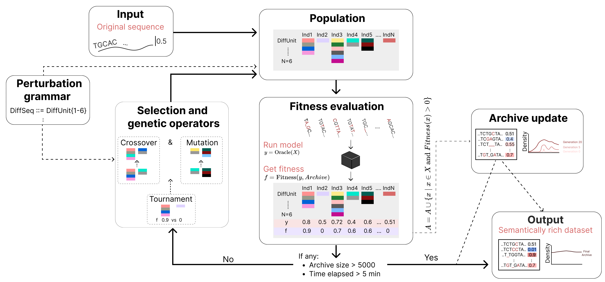

[](https://github.com/PedroBarbosa/dress/actions/workflows/run_tests.yml)

#### DRESS - Deep learning-based Resource for Exploring Splicing Signatures

This software aims to provide a flexible framework for RNA splicing research guided by performant deep learning models. 

At its core, dress relies on genetic programming to 
perform data augmentations that create diversity in the semantic space of a deep learning oracle (e.g., SpliceAI, Pangolin). The augmentations - created through perturbations on exon triplets - are constrained with [grammars](https://en.wikipedia.org/wiki/Context-free_grammar), which restrict perturbations based on knowledge about the splicing domain. The package is build on top of [GeneticEngine](https://github.com/alcides/GeneticEngine), a framework for Genetic Programming in Python.

Importantly, the expressive power of these grammars enhances model interpretability. The genotype of individuals (synthetic sequences) in the genetic programming population is closely related to RNA splicing concepts.



These ideas were accepted for publication at Genetic
and Evolutionary Computation Conference (GECCO'24). The preprint is available at [arXiv](https://arxiv.org/abs/2407.02984v1). The sotware includes an extensive set of options to control the evolutionary search based on the desired in silico experiments and problem specific requirements. For example, by default dress avoids perturbing splice site regions (within a given genomic window), but that can easily be changed to avoid perturbing entire exons, forcing the search to focus on upstream/downstream introns of alternatively spliced exons.

The software can be used for several applications, including:
- Generate local datasets for explainableAI (e.g., train intrinsically interpretable models, like LIME).
- Generate synthetic sequences for feature attribution analysis and motif discovery (e.g., TF-MoDISCo).
- Ablation studies for studying alternative splicing.

As for now, the package contains two modules:
 - `generate` is the main command. It generates synthetic data from a start sequence using a grammar and a deep learning oracle.
 - `filter` command filters sequences based on desired levels of splice site probability, PSI or dPSI.

## Installation

Clone the repo, take care of dependencies with `conda` or `mamba` and install the package with `pip`:

```
git clone https://github.com/PedroBarbosa/dress.git
cd dress
conda env create -f conda_env.yml
conda activate dress
pip install .
```

## Running example

dress accepts bed or tabular (see input example [here](data/examples/generate/raw_input/FAS_exon6/data.tsv)) inputs, and requires a locally stored pre-computed exon cache, along with the human reference genome.

First, download the necessary files. The required transcript structure cache (from GENCODE v44) can be downloaded from [here](https://app.box.com/s/tbh293kqh1s9nbi624esl0c18maxuhss). Then, download the human genome hg38 (for example from [here](https://ftp.ebi.ac.uk/pub/databases/gencode/Gencode_human/release_45/GRCh38.primary_assembly.genome.fa.gz), uncompress it and optionally simplify chromosome headers with `sed '/^>/s/ .*//'`. Place both files in a single directory, which is given in `--cache_dir`. By default, it expects this data to be in `data/cache`.

To run an evolutionary search with an input exon (for example, the exon 6 of FAS gene), we simply call:

`dress generate data/examples/generate/raw_input/FAS_exon6/data.tsv`

The full list of argument options can be inspected with `dress generate --help` or by looking at one of the pre-configured yaml files at `dress/configs/generate*`.

Full documentation and tutorials detailing the complete capabilities of this software will be available soon.